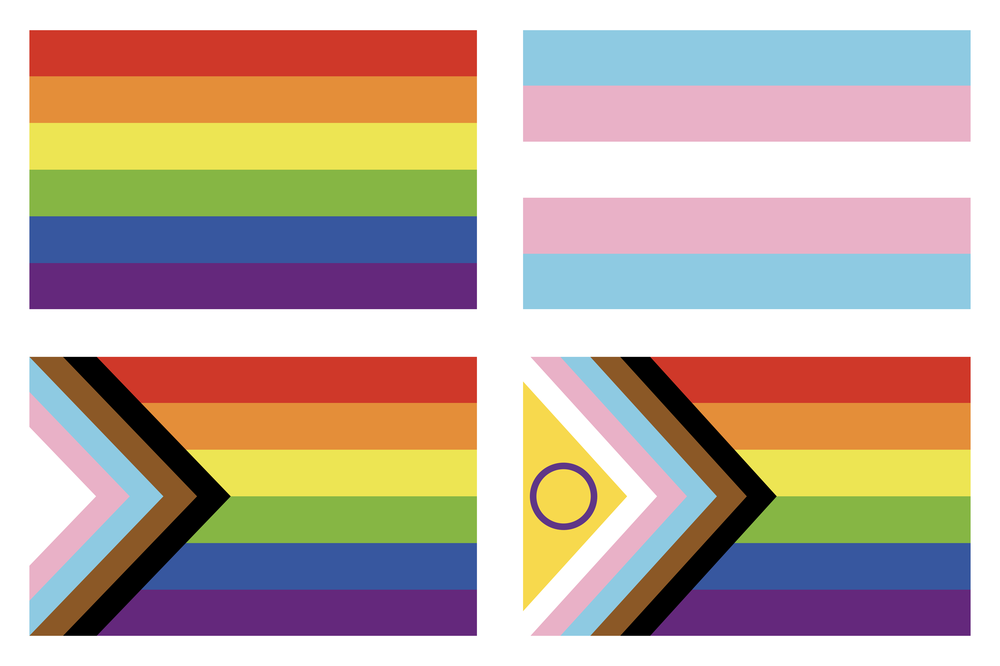

## Draw Pride Flags with [{ggplot2}](https://ggplot2.tidyverse.org)

Custom code to draw four types of pride flags: rainbow, trans, progress and intersex-inclusive progress. Most color codes are based on eyedropper hexcodes from the Wikipedia page <https://en.wikipedia.org/wiki/Rainbow_flag_(LGBTQ)>. The image below is made with [{patchwork}](https://patchwork.data-imaginist.com) to arrange the flags in a 2x2 grid.

Alt-text: A panel with four pride flags: top left the six-stripe rainbow flag; top right: the trans flag; bottom left: the progress pride flag; bottom right: the intersex inclusive progress pride flag.
